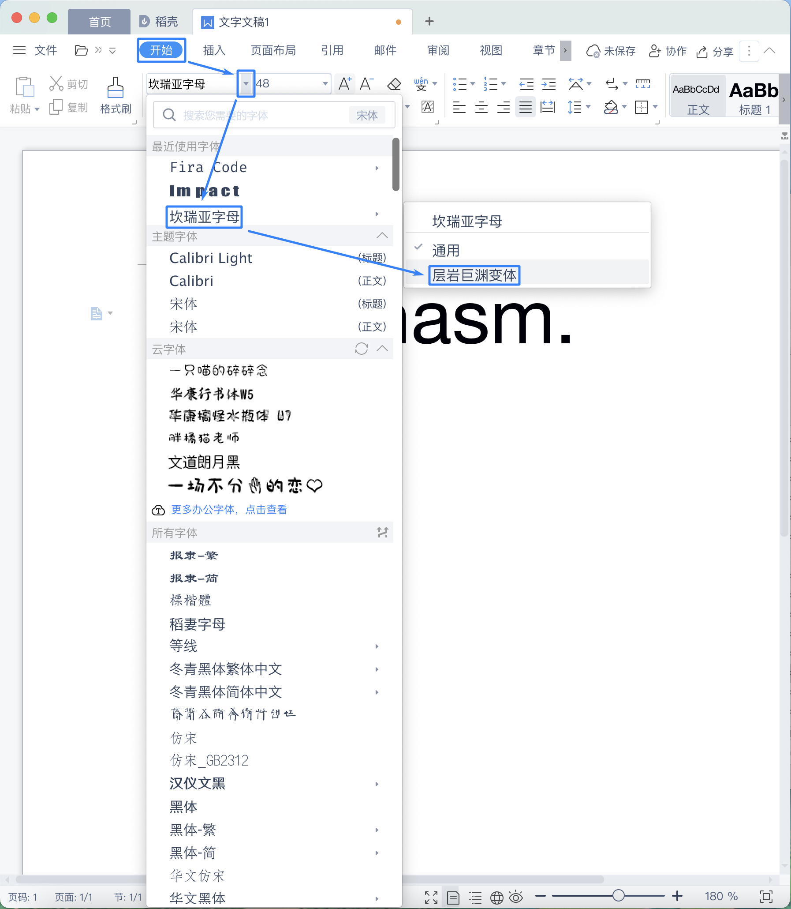
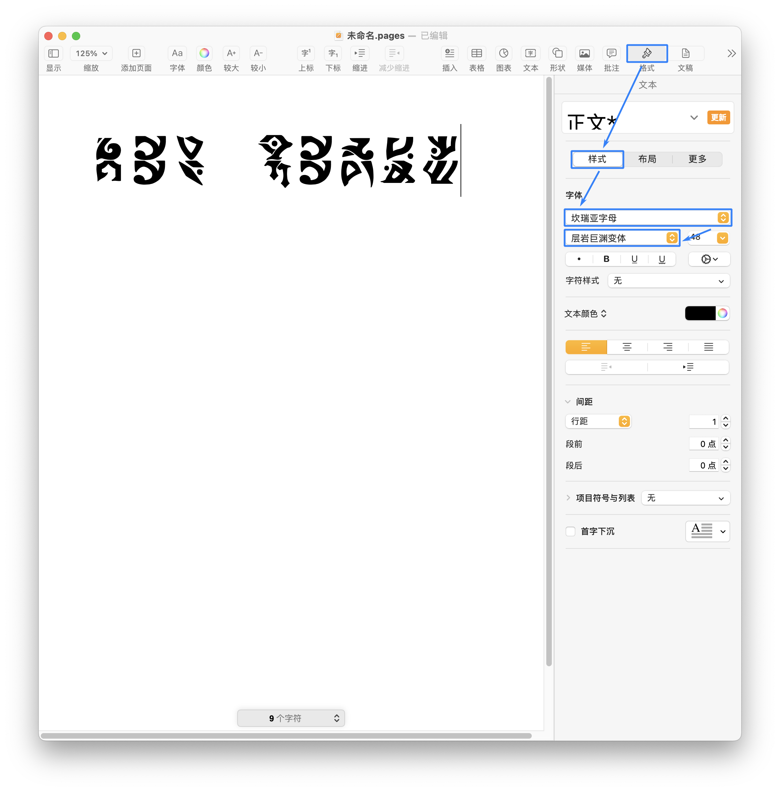

# Hoyo Glyphs


🌏 **[English](README_en.md)** | 简体中文

## 简介

这个仓库储存了米哈游的游戏里的架空文字的字体。这些字体**并非游戏解包文件**，敬请放心使用。

如果只是想随便玩一玩这些字体，可以到[这里](https://speedyorc-c.github.io/Hoyo-Glyphs/demo/index.html)看看。

## 如何使用？

### 下载（OTF 格式）

- [提瓦特字母](font/genshin-impact/TeyvatNeue-Regular-1.001.otf)
- [稻妻字母](font/genshin-impact/InazumaNeue-Regular-0.006.otf)
- [坎瑞亚字母](font/genshin-impact/KhaenriahNeue-Regular-2.000.otf)
- [坎瑞亚字母层岩巨渊变体](font/genshin-impact/KhaenriahNeue-Chasm-2.000.otf)
- [星穹铁道字母](font/honkai-star-rail/StarRailNeue-Regular-0.001.otf)
- [绝区零字母](font/zenless-zone-zero/ZzzNeue-Regular-0.002.otf)

### 安装

双击直接安装即可。如果需要更新，请务必卸载旧的字体。

### 使用变体

#### WPS Office



#### Pages



## 免责声明

**请勿将此字体用于任何商业行为，否则后果自负！**

## 目前游戏里有哪些文字？

游戏里所有的文字都包含在下面的列表里面。如果前面打了个勾，
表示这个文字的字体已制作完成，可以在这个仓库里找到。

### 《原神》

- [X] 提瓦特文字（蒙德）
- [X] 稻妻文字
- [X] 坎瑞亚文字
- [X] 坎瑞亚文字 - 层岩巨渊变体
- [ ] 须弥文字（暂定）
- [ ] 须弥文字 - 沙漠变体（暂定）

### 《崩坏·星穹铁道》

- [X] 星穹铁道文字（暂定）

### 《绝区零》

- [X] 绝区零文字（暂定）

### 哪些文字不做？

- 石根文字（原神 - 稻妻 - 鹤观）
- 璃月文字（原神 - 璃月）

## 渲染出错？

如果这里的字体在您的软件中出现太大、太小或渲染出错的情况，请在[这里](https://github.com/SpeedyOrc-C/Hoyo-Glyphs/issues)提出 Issue，谢谢。

## 更新记录与已知问题

### 提瓦特字母 Teyvat Neue

### v1.002

添加了数字 `4` 的字形。

稍微修改了数字 `3` 的字形。

#### v1.001

添加了以下几个数字的字形：
```
0 1 2 3
```
数字目前仅在以下两种情况出现：

1. 装备了四个或以上**华馆梦醒形骸记**的圣遗物时，通过岩元素命中敌人时会积攒“问答”效果，
   最多可以积累四层，若没有获得效果6秒后，将损失一层。
   层数改变时，通过黄色通用文字的数字显示在角色身上。

2. **烟绯**进行普通攻击时，命中敌人后会累积丹火印，最多可以获得三个。
   在进行重击的时候，所有丹火印会被消耗。
   此时，烟绯身上将通过绯红通用文字的数字显示刚刚消耗了多少个丹火印。

### 星穹铁道字母 Star Rail Neue

#### v0.001

目前，该游戏已经完成第一次测试，第二次测试正在进行中。

### 绝区零字母 ZZZ Neue

#### v0.002

添加了字母 `C` 和 `K` 的字形。

在 2022 年 5 月 13 日之后，发现这种字母包含一种变体，其中部分字形横画没有左上角的切角。

#### v0.001

目前，该游戏的第一次测试还未开启，处于宣发阶段。

### 坎瑞亚字母 Khaenri'ah Neue

#### v2.000

添加了层岩巨渊变体的坎瑞亚字母。

### 稻妻字母 Inazuma Neue

#### v0.006

将以下字母变得更加清晰：
```
C D F L R T X
```
来自鹿野院平藏的思绪。

添加了竖线 `|` 的字形。

#### v0.005

添加了模糊的字母 `X` 的字形。

#### v0.004

添加了字母 `Q` 的字形，来自“光华容彩祭”的排队牌子。

缩小了字母 `D` 和 `U`。

根据字符的笔画，调整了所有字母的左右边距，使得带有垂直的笔画的字符更加靠近左侧。

#### v0.003

添加了字母 `V` 的字形。

稍微减小了以下字母的宽度：

```
A E I K N O S T
```

#### v0.002

添加了字母 `J` 的字形，同时字母 `L` 现在也在它该在的地方了。

稍微减小了字母 `H` 和 `N` 的宽度。

#### v0.001

部分字母来源于游戏内的模糊截图，显示效果可能与实际不符，这些字母是：

```
A B C D F L T W Y Z
```

部分字母还没有被制作成字体，这些字母是：

```
J P Q V X
```

由于我的疏忽，不小心把字母 `L` 的字形给到了字母 `J` 上，请尽快更新到最新版本。
