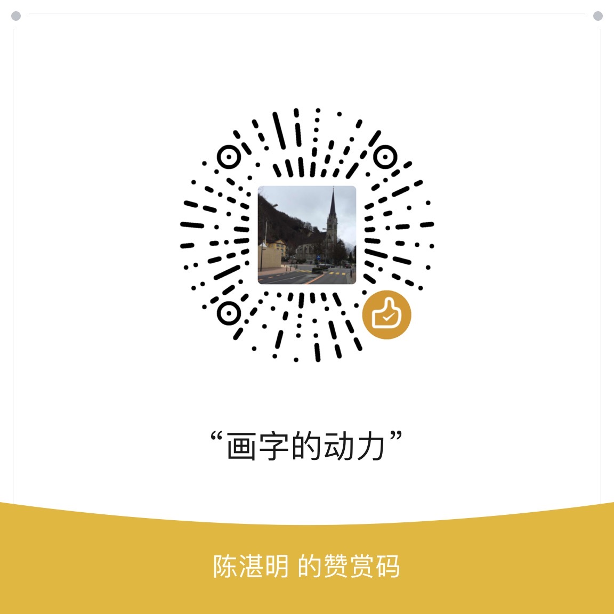

# HoYo Glyphs

🌏 **[English](README_en.md)** | 简体中文

## 简介

这个仓库储存了米哈游的游戏里的架空文字的字体。这些字体**并非游戏解包文件**，敬请放心使用。

如果您想第一时间知晓本仓库的更新，请点击上方的眼睛图案（即 watch）。

## [下载](download.md)

请移步至 Release 查看。

## 赞赏

制作字体极其耗时间，虽然这里的字体皆是免费提供，如果觉得好用的话，就来赞赏我吧！

## 更新记录与已知问题

请移步至 Wiki 查看。

## 目前游戏里有哪些文字？

游戏里所有的文字都包含在下面的列表里面。如果前面打了个勾，
表示这个文字的字体已制作完成，可以在这个仓库里找到。

### 《原神》

- [X] 提瓦特文字（蒙德）
- [X] 稻妻文字
- [X] 坎瑞亚文字
- [X] 坎瑞亚文字——层岩巨渊变体
- [X] 须弥文字
- [X] 赤冠文字

### 《崩坏：星穹铁道》

- [X] 星穹铁道文字（黑塔空间站）
- [X] 罗浮文字

### 《崩坏三》

- [X] [火星文](https://github.com/SpeedyOrc-C/Honkai-3rd-II-Martian) 由于书写系统较为复杂，暂时无法做成字体，目前仅有使用网页技术的实现。

### 《绝区零》

- [X] 绝区零系统文字
- [X] 绝区零甲文字
- [ ] 绝区零乙文字

### 哪些文字不做？

- 石根文字（原神 - 稻妻 - 鹤观）
- 璃月文字（原神 - 璃月）
- 兰那罗文字（原神 - 须弥）

## 渲染出错？

如果这里的字体在您的软件中出现太大、太小或渲染出错的情况，请在[这里](https://github.com/SpeedyOrc-C/HoYo-Glyphs/issues)提出 Issue，谢谢。

## 使用变体

### Microsoft 365 (Office)

在这里，字体变体不会显示，而是将每个变体显示为独立的字体。
另外，也不会以中文来显示字体名称，而是使用英语。

### WPS Office

### Apple Pages

