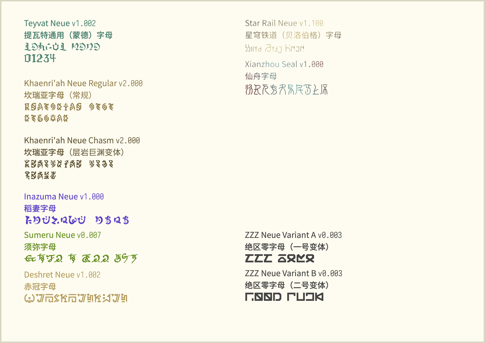

# HoYo Glyphs

🌎 English | **[简体中文](README.md)**

## Intro

This repository contains the fonts of the constructed writing systems
in the video games developed by Hoyoverse. These fonts are
**not obtained from any forms of reverse engineering to the games**. 

If you want to track the updates on this repository, please click the eye icon `watch` above.

## [Download](download_en.md)

Please be aware that I'll move all the fonts published in the future
into Release. So please find what you need in Release's folder.

Also, I'll gradually move all the existing fonts into Release.

## Update Log & Known Issues

Please go to Wiki.

## Included Writing Systems

All the writing systems that appeared in the game are listed below.
A tick means the font of this writing system is ready to use from this repository.

### Genshin Impact

- [X] Teyvat Script (Mondstadt)
- [X] Inazuma Script
- [X] Khaenri'ah Script
- [X] Khaenri'ah Script - The Chasm's Variant
- [X] Sumeru Script
- [X] Deshret Script

### Honkai - Star Rail

- [X] Star Rail Script
- [ ] Star Rail Script (VARIABLE FONT!!!)
- [X] Luofu Script

### Zenless Zone Zero

- [X] ZZZ Script - Variant A (temporary name)
- [X] ZZZ Script - Variant B (temporary name)

### Writing Systems that We Won't Add

- Ishine Script (Genshin Impact - Inazuma - Tsurumi)
- Liyue Script (Genshin Impact - Liyue)

## Have Rendering Issues?

If you have issues with rendering, please report on
[the Issue page](https://github.com/SpeedyOrc-C/Hoyo-Glyphs/issues).
