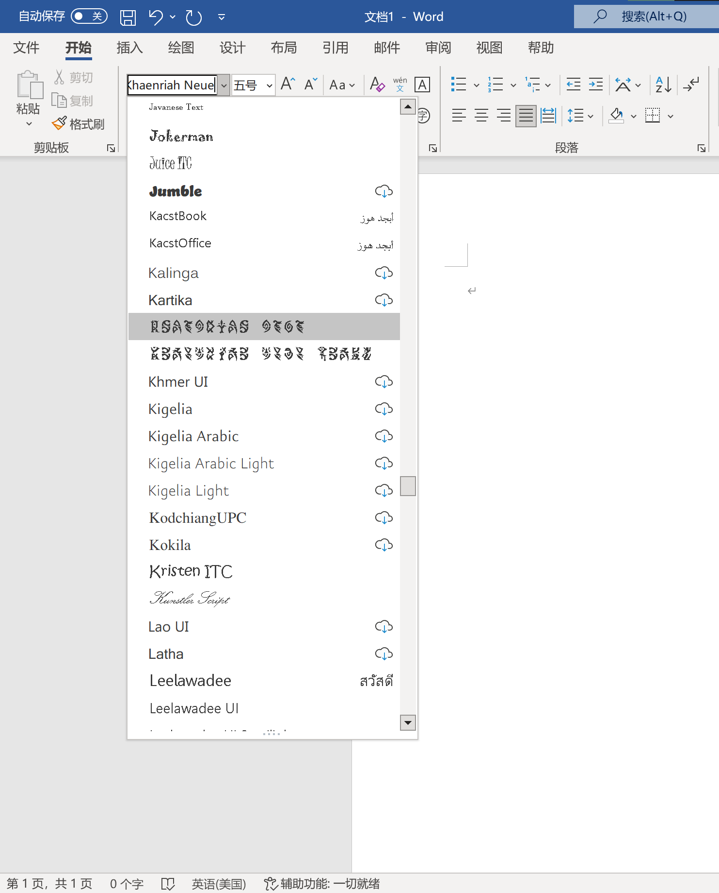

# Download

## DISCLAIMER

**ONLY FOR NON-COMMERCIAL USE. USE IT AT YOUR OWN RISK!**

## Links

[The Alphabet](https://github.com/SpeedyOrc-C/HoYo-Glyphs/releases/tag/Alphabet-20230630)

### Genshin Impact

[Teyvat Black](https://github.com/SpeedyOrc-C/HoYo-Glyphs/releases/tag/teyvat-black-1.003) (The common script on Teyvat)

- [Inazuma Glyph](font/genshin-impact/inazuma/InazumaNeue-Regular-1.000.otf)
- [Sumeru Glyph](font/genshin-impact/sumeru/SumeruNeue-Regular-0.007.otf)
- [Deshret Glyph](font/genshin-impact/deshret/DeshretNeue-Regular-1.002.otf)
- Khaenri'ah Glyph
  - [Regular](font/genshin-impact/khaenriah/KhaenriahNeue-Regular-2.000.otf)
  - [The Chasm's Variant](font/genshin-impact/khaenriah/KhaenriahNeue-Chasm-2.000.otf)

### Honkai - Star Rail

- [Star Rail Neue - Family](https://github.com/SpeedyOrc-C/Hoyo-Glyphs/releases/tag/star-rail-neue-1.100) (Used in Belobog, Herta Space Station, and UI)

- [Xianzhou Seal - Family](https://github.com/SpeedyOrc-C/HoYo-Glyphs/releases/tag/xianzhou-seal-1.000) (Used in 6 spaceships of Xianzhou)

### Zenless Zone Zero

- [ZZZ Glyph - Variant A](font/zenless-zone-zero/ZZZNeue-VariantA-0.003.otf)
- [ZZZ Glyph - Variant B](font/zenless-zone-zero/ZZZNeue-VariantB-0.003.otf)

## Notice

* For all fonts released after May 2023, you will find `ttf`, `otf`, `woff2` and apple device version.
* Apple device version contains fonts in `otf` format, which can be found in folder `apple`. 
* Please uninstall the old font before install the new one. 

## Using Variants

### Microsoft Office

Individual fonts will show up here instead of font variant.

### Apple Pages

